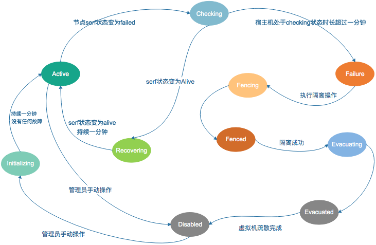
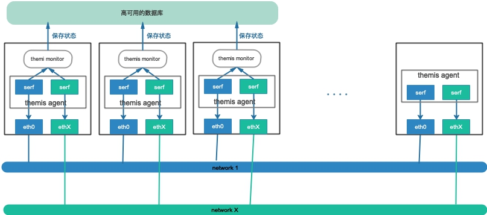

## 项目简介

本项目的目标是让OpenStack集群的计算节点宕机后，可以自动的完成虚拟机的疏散，而不需要运维人员介入。

### 一、需求概述

[OpenStack](https://www.openstack.org/)是一套可用于构建私有云和公有云的一整套软件，但是OpenStack并不是一套成熟的商业产品。在使用OpenStack构建私有云或公有云的过程中，有大量的工作要做，平台的高可用就是其中的一项。随着集群规模的扩大，硬件设备发生故障的概率会逐步提升，如何避免单点故障以及如何降低硬件故障对云平台的影响，成为了云服务提供商必须面对和解决的问题。

在一个OpenStack集群中，提供虚拟机的计算节点通常是数量最多的服务器，因此发生故障的概率也最高，而云平台用户的业务就是部署在虚拟机里面。一旦计算节点出现硬件故障导致意外宕机，势必会影响其上运行的虚拟机，从而影响客户的业务。 在计算节点发生宕机时，能够快速的在其他计算节点重建并启动虚拟机是一个普遍的需求，一方面通过底层的分布式存储保证虚拟机的数据不丢失，另一方面通过快速的重建虚拟机，实现快速的业务恢复。

OpenStack对这个需求提供了基本的支持，OpenStack中负责计算资源创建和调度的子项目[Nova](https://docs.openstack.org/nova/latest/)提供了虚拟机[疏散接口](https://docs.openstack.org/nova/rocky/admin/evacuate.html)，但是OpenStack并没有提供整套完整的方案，也没有触及宕机后自动化疏散在实现上的难点：

  * 如何准确的判断服务器只是暂时性的网络不通，还是宕机了
  * 如何有效的隔离出现故障的服务器，保证故障后，集群能够快速的收敛到一个稳定可用的状态

本项目参考了[CloudStack](https://cloudstack.apache.org/)的[宿主机HA实现方案](https://cwiki.apache.org/confluence/display/CLOUDSTACK/Host+HA)及[海云捷迅](https://www.awcloud.com/)在这方面的[实践](https://www.infoq.cn/article/OpenStack-awcloud-HA)，给出了可以实际落地的开源实现。

### 二、方案概述

为了实现OpenStack集群的计算节点宕机后能够自动完成虚拟机的疏散，实现方案包括以下三个方面：

  * 故障检测：在一个分布式集群中，可能出现故障的地方实在是太多了，如：磁盘故障、网络故障、内存故障、操作系统故障、虚拟化软件故障、虚拟机操作系统故障、应用故障等。在一个分布式系统中，故障检测就更加困难和麻烦了，因为分布式系统中很难判断到底是与之通信的程序出问题了还是网络出问题了。因此，如何准确及时的识别系统中存在的故障非常关键。
  * 故障确认：在分布式系统中，因为网络通信是不可靠的，所以，可能出现一些临时的故障，这些故障如果能够在一定的时间范围内恢复，就不会对系统正常的功能造成影响，对于这类故障，我们可以忽略不做处理。因此，不是一旦检测到故障就开始执行故障处理，还必须有一个确认的过程。故障的确认不是一件容易的事情，如果确认的条件太宽泛，可能导致反应过度，造成误伤；如果确认条件太严格，有可能导致漏掉了重要的故障，从而影响到用户的使用和体验。为此，设置合适的确认条件需要考虑多方面的因素，也需要根据系统长期的运行情况加以调整，以便条件是合宜的。
  * 故障隔离与恢复：一旦检测出故障，就必须尽快隔离有故障的资源，以免影响到其他没有故障的资源，与此同时，还要尽快恢复受影响的资源。

#### 2.1 故障检测

本方案选择了[serf](https://www.serf.io/)作为分布式的网络故障检测工具，选择serf做故障检测主要的原因如下：

* serf 实现了[gossip](https://en.wikipedia.org/wiki/Gossip_protocol)协议，是一个分布式的故障检测工具，能够在较短的时间内发现集群中的网络故障；serf官网提供了一个收敛时间[模拟器](https://www.serf.io/docs/internals/simulator.html)，可以比较直观的看到不同规模下的收敛时间；
* serf 提供的event和query机制非常灵活，很容易扩展，可以很方便的实现自定义的检测条件或预定义的操作； 
* serf 具有良好的扩展性，不同规模的集群都适用；此外，serf 功能单一，配置简单，维护方便；

在OpenStack集群中，实际部署时，通常会有若干个功能不同的网络（如：管理网、存储网、业务网），为了保证故障检测的准确性，每个服务器的每个网络都需要启动一个serf进程对其进行监控，一旦网络出现故障，集群中其他的服务器上运行的serf进程通过gossip协议很快就能够发现。

故障检测程序可以通过监听serf触发的事件来感知网络异常，也可以周期性的向serf查询集群所有节点的状态，一旦检测到有节点变成了failed状态，就启动故障确认的流程。

因为网络状态的检测依赖于serf，如果serf因为某种原因重启或停止运行，可能会影响检查的准确性。因此需要对serf程序进行监控，一旦检测到serf退出了，会立刻进行重启，确保serf一直处于运行。

#### 2.2 故障确认

一旦检测到某个节点网络故障，为了安全起见，不是立即对主机进行隔离，而是对主机执行故障确认操作。为了跟踪主机的状态，需要引入主机状态转换机制。本项目定义了如下的主机状态：

* Disabled：监控程序会忽略所有disabled状态的宿主机；当一个主机因为故障被隔离起来了，为防止监控程序再次发起隔离操作，需要将主机设置为disabled状态；当运维人员排查并处理完故障后，需要手动enable一下，这样监控程序会再次对其进行监控；
*  Initializing：宿主机刚被录入到系统中，或者管理员手动标记为enable时的状态；如果一分钟之内都没有检测到任何故障，状态会变为active；
*  Active：状态良好，没有任何故障，或已经从故障中恢复了； 
* Checking：监控程序检测到故障，正在确认的过程中；如果故障持续超过1分钟，而是是严重故障，宿主机的状态就会变成Failed状态； 
* Recovering：隔离之后，节点再次加入集群，故障已经消失，如果一段时间内没有检测到故障，会变成Active状态；（暂时没有实现这个状态） 
* Failed：已经确认出现网络故障，监控程序接下来可以执行故障隔离；
* Fencing：确认故障后，正在执行隔离操作的过程中； 
* Fenced：确认故障后，隔离操作执行完毕； 
* Evacuating：隔离完成后，开始疏散宿主机上的虚拟机； 
* Evacuated：虚拟机疏散工作完成；完成后，宿主机的状态会变为Disabled状态，需要管理员检查并排除故障；

主机状态转换如下图所示：

在OpenStack集群中，存在多个功能不同的网络，网络故障带来的影响也不同，有些网络故障不影响虚拟机里面运行的业务，有些则会导致虚拟机中运行的业务中断。因此，需要引入一个决策矩阵，用来判定在各类网络故障下，是否应该执行隔离操作。本项目实现的决策矩阵如下：

| 管理网的状态 | 存储网的状态 | 业务网的状态 | 是否执行隔离操作 |
| :----------: | :----------: | :----------: | :--------------: |
|     good     |     good     |     good     |        no        |
|     good     |     good     |     bad      |       yes        |
|     good     |     bad      |     good     |       yes        |
|     good     |     bad      |     bad      |       yes        |
|     bad      |     good     |     good     |        no        |
|     bad      |     good     |     bad      |       yes        |
|     bad      |     bad      |     good     |       yes        |
|     bad      |     bad      |     bad      |       yes        |

从上面的决策矩阵可以看出，一旦监测到存储网或业务网中的任何一个网络出现故障超过一分钟，就认为故障确实发生了，就会发起隔离操作。

#### 2.3 故障隔离

本项目采用[IPMI](https://zh.wikipedia.org/zh/IPMI)来实现故障主机的隔离。为了能够在故障发生后完成隔离，需要预先录入每个节点的IPMI信息，通过IPMI接口，监控程序可以让故障节点强制断电，以保障主机上的虚拟机确实关闭了。

如果虚拟机没有关闭，通过OpenStack发起evacuate操作后，可以回导致一个虚拟机在两个主机上跑，还共用系统盘和数据盘，这可能导致虚拟机的数据被写花，因此保证虚拟机确实被关闭了很重要。

考虑到虚拟机可能隶属于不同的服务，需要考虑放置策略，迁移操作的目的节点，尽可能通过nova的调度程序计算来决定。

如果OpenStack集群没有资源了，虚拟机疏散可能失败，因此，在平时的运维过程中，需要关注集群的总体容量，预留出一个或多个主机的资源，以保证发生故障时，集群有足够的资源重新启动虚拟机。

注意：因为需要用到IPMI，所以在部署的时候 ，需要确保监控程序能够访问IPMI网络。

#### 2.4 总体架构

本项目实现方案的总体架构如下图所示：

实现方案包括两个组件：

- themis monitor：
  - themis monitor负责记录、维护及评估集群宿主机的状态，如果宿主机发生了故障，themis monitor负责对宿主机的状态发起检查； 一定确认故障，themis monitor会调用IPMI接口，关闭有故障的宿主机，疏散上面的虚拟机。
  - themis monitor需要部署不同的节点上，以实现自身的HA。运行在多个节点上的themis monitor通过选举算法选出一个Leader，Leader负责维护宿主机的状态和隔离有故障的宿主机。
- themis agent：themis agent负责监控故障监测程序serf，一旦检测到某个故障监测退出了，能够自动重启，保证监测程序的高可用。

### 三、安装部署

详见[部署文档](docs/install.md)

### 四、使用方法

详见[使用手册](docs/usage.md)

### 五、TODO列表

* 目前的实现中，决策矩阵是固定的，可以引入一个参数来说明网络的重要性，然后又监控程序自动生成决策矩阵；
* 目前的实现中serf依赖组播来实现彼此的自动发现，如果网络不允许组播，需要运维人员完成初始化的工作；可以通过给serf提供`retry-join`参数来避免这个问题；
* 目前的实现中，执行虚拟机疏散时，只能由OpenStack自己决定迁移到哪儿，不能迁移到指定的主机上。